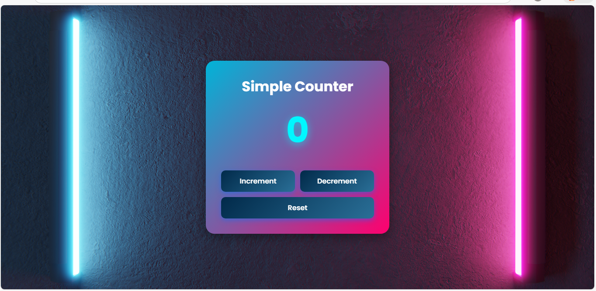

# Counter App

A simple, responsive, and interactive **Counter Application** built using **HTML, CSS, and JavaScript**.
This project demonstrates DOM manipulation, event handling, responsive UI design, and gradient/glass-style modern UI styling.

---

## Features

* Increment, decrement, and reset functionality
* Fully responsive UI for all screen sizes (mobile, tablet, desktop)
* Glassmorphism background container
* Modern gradient buttons with hover effects
* Clean and smooth animations
* Background image with full-cover layout
* Uses `textContent` to update values quickly and efficiently

---

## Technologies Used

* **HTML5** – Structure
* **CSS3** – Styling, responsive design, gradients, flexbox
* **JavaScript (Vanilla JS)** – Counter logic, DOM manipulation
* **Google Fonts (Poppins)**

---

## Project 

```
Counter App/
│── index.html
│── style.css
│── app.js
│── Assets/
│ └── abstract-uv-ultraviolet-light-composition.jpg
```


---

## How It Works

* `count` variable stores the current number
* `increment()` increases count
* `decrement()` decreases count
* `reset()` sets count back to zero
* `document.getElementById("value").textContent` updates the display in real-time

---

## How to Run the Project

1. Download or clone the repository
2. Open the folder
3. Simply open **index.html** in any browser
4. No installation or server required

---

## Live Preview

(https://counter-o-app.netlify.app/)

---

## Screenshots



---


## Author

Developed by **Ayesha Noor**.
Feel free to use, improve, or customize this project.

---

## License

This project is open-source and free to use for learning and practice.

---

If you like this project, consider giving the repo a ⭐ on GitHub!


